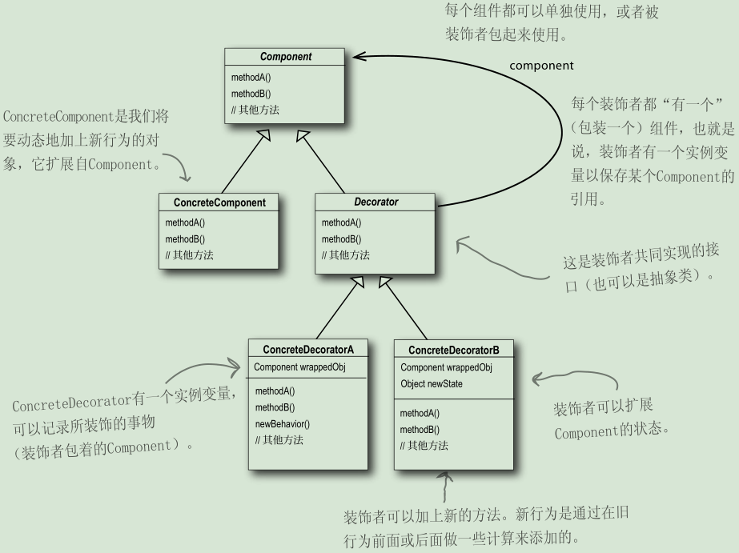
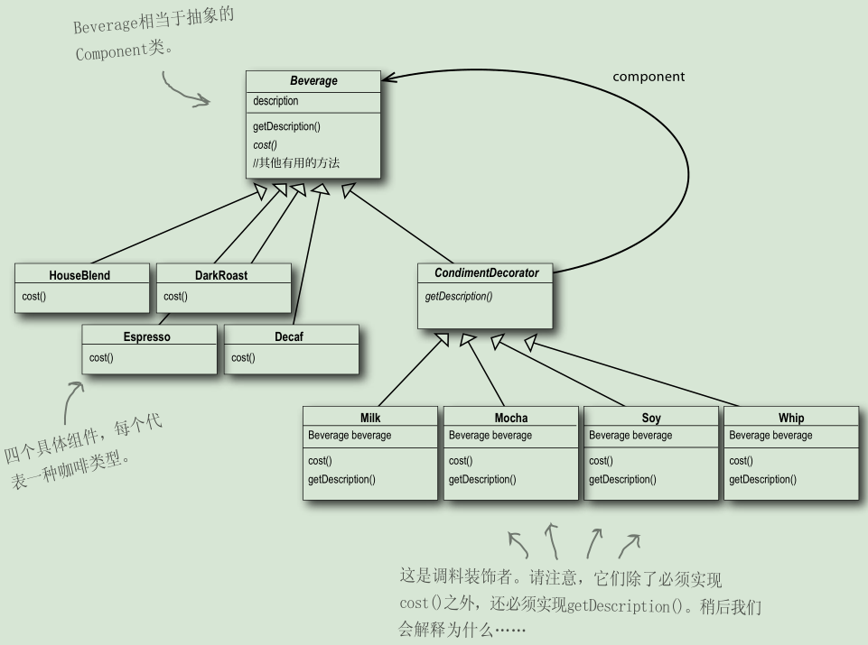

# 设计原则

- 封装变化
- 针对接口编程，而不是针对实现编程。
  - 针对接口编程真正的意思是：针对超类型编程。
- 多用组合，少用继承。
  - 例如：鸭子的行为（飞行、呱呱叫）可以用组合来
- 为了交互对象之间的松耦合设计而努力。
- 类应该对拓展开放，对修改关闭。（开放-关闭原则）

# 设计模式

## 策略模式（Strategy Pattern）

### 定义

> 策略模式定义了算法族，分别封装起来，让它们之间可以互相替换，此模式让算法的变化独立于使用算法的客户。

## 观察者模式

### 定义

> 对象之间的一对多依赖，这样一来，当一个对象改变状态时，它的所有依赖都会收到通知并自动更新。

## 装饰者模式

### 定义

> 装饰者模式动态地将责任附加到对象上。若要拓展功能，装饰者提供了比继承者更有弹性的替代方案。

### 个人领悟

- 装饰者和被装饰者类型要一致，也就是有共同的超类
- 继承Beverage抽象类，是为了有正确的类型，而不是继承它的行为。行为来自装饰者和基础组件，或与其他装饰者之间的组合关系。
- 通常装饰者模式是采用抽象类，但是在Java中可以使用接口。
- 装饰者通常是用其他类似于工厂或生成器这样的模式创建的。
- “缺点”：利用装饰者模式，常常造成设计中有大量的小类，数量实在太多，可能会造成使用此API程序员的困扰。
- 装饰者会导致设计中出现许多小对象，如果过度使用，会让程序变得很复杂。

